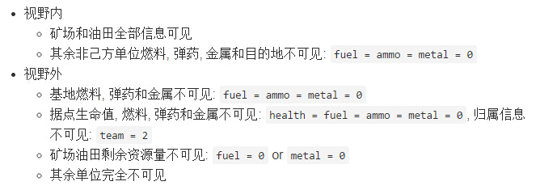
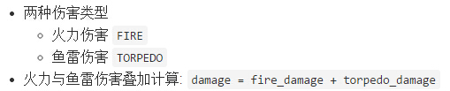
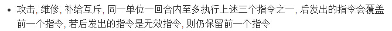
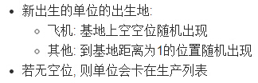
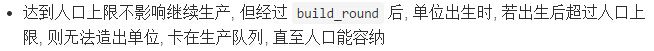

# FAQ - Deep Blue

## 规则

### Q1. 单位的索引号 `index` 在回合间会变吗?

A: 
* **不会变**, 单位在被生成的同时被赋予 `index`, 在该单位的有生之年(仅限此局游戏)内都不会改变

* 单位1被摧毁后, `index` 失效, 本回合新生产出的单位2的 `index` 不会与单位1的 `index` 相同(但是仅保证本回合不会相同, 下回合出生的单位3的 `index` 则有可能与上一回合阵亡的单位1的 `index` 相同)

### Q2. 视野外的单位我完全看不到吗?

A:
* **并不是**, 如下图:

* 视野内也不一定能访问到对方的所有信息
* 基地的生命值是**全局可见**的
* 视野外的据点无论是中立还是敌方的, 访问到 `team` **始终为2**
* 强行访问其余不可见信息, 得到的**返回值为0**, 请选手自行甄别
* **不存在**敌我双方都完全看不到的单位

### Q3. 攻击方式分为两种, 实际攻击时是自动选定的吗?

A: 
* 攻击时会同时计算火力伤害和鱼雷伤害, 选手**不能**自主选择攻击方式

* 以战斗机攻击驱逐舰为例
    * `Fighter`
    ```py
    pos = Position(1, 1, 2)
    attacks = [30, 20]
    fire_ranges = [1, 3, 4]
    ```
    * `Destroyer`
    ```py
    pos = Position(2, 2, 1)
    defences = [13, 10]
    ```
    * 结算过程
    ```py
    distance = abs(2 - 1) + abs(2 - 1) = 2
    fire_range = fire_ranges[1] = 3
    modified_attacks[0] = int((1 - float(distance - fire_range / 2) / (fire_range + 1)) * attacks[0]) = 22
    modified_attacks[1] = int((1 - float(distance - fire_range / 2) / (fire_range + 1)) * attacks[1]) = 15
    fire_damage = max(0, modified_attacks[0] - defences[0]) = 9
    torpedo_damage = max(0, modified_attacks[1] - defences[1]) = 5
    damage = fire_damage + torpedo_damage = 14
    ```
* 将上例中的驱逐舰换成潜艇
    * `Submarine`
    ```py
    pos = Position(2, 1, 0)
    defences = [INF, 7]
    ```
    * 结算过程同理
    ```py
    distance = abs(2 - 1) + abs(1 - 1) = 1
    fire_range = fire_ranges[0] = 1
    modified_attacks[0] = int((1 - float(distance - fire_range / 2) / (fire_range + 1)) * attacks[0]) = 15
    modified_attacks[1] = int((1 - float(distance - fire_range / 2) / (fire_range + 1)) * attacks[1]) = 10
    fire_damage = max(0, modified_attacks[0] - defences[0]) = 0
    torpedo_damage = max(0, modified_attacks[1] - defences[1]) = 3
    damage = fire_damage + torpedo_damage = 3
    ```
* 以上两例, 攻方均 `ammo -= ammo_once`, 与防守方是否免疫某种伤害无关; 即使同时造成火力和鱼雷伤害, 也**不会**出现 `ammo -= 2 * ammo_once` 的情况

### Q4. 修正攻击力的公式中浮点数与取整太混乱搞不清!

A:
* 以**Q3**第二个例子为例, 以下为逐步过程
```cpp
modified_attacks[0] = int((1 - float(distance - fire_range / 2) / (fire_range + 1)) * attacks[0])
    = int((1 - float(1 - 1 / 2) / (1 + 1)) * 30)    // 注意这里 1/2 是整除
    = int((1 - float(1 - 0) / 2) * 30)
    = int((1 - 1.0 / 2) * 30)
    = int(0.5 * 30)
    = 15
```
* 另外, 攻击修正后可能大于原来的攻击力

### Q5. 哪些指令互斥?

A:
* 直接上图

* 攻击和补给互斥意味着同一单位不能在同一回合内既攻击敌方又补给己方, 只能**选其一**(修理, 补给, 攻击相互互斥, 同理)
* 不同单位之间的指令不影响
* 单位被补给或被修理不影响该单位的指令, 但遵循事件结算顺序

* 再次强调, 除了移动事件按速度降序结算, 其他**同种事件结算顺序是随机的**
* 事件结算的模式为: 结算完一个事件, 再结算下一个事件
* 被击毁的单位将立刻被清除, 其当回合的剩余指令无法发出
* 例: 在同一回合内, 单位1和单位2互相攻击, 若单位1攻击先于单位2的攻击结算(随机结果), 且单位2被击毁, 则单位2的攻击事件不结算
* 生产和其他指令不互斥, 生产与生产不互斥, 可以**同时**生产多个单位

### Q6. 关于生产有很多问题!

A:
* 再重复一遍, 生产和其他指令不互斥, 生产与生产不互斥, 可以**同时**生产多个单位
* 生产的开销
    * 金属开销 `metal_consumed = cost` (注意 `cost != health_max / health_per_metal`)
    * 时间开销 `time_consumed = build_round` (最新版规则文档已经附上该数据)
    * 产后补给开销
    
* 单位的出生地点

* 若无空位, 则单位会卡在生产列表, 直至基地周围有可出生的空位
* 人口超上限怎么办!

* 一旦加入生产列表, **无法撤销**, 请慎重
* 正在生产列表中的单位没有索引号

### Q7. 各种指令的使用距离?

A:
* 攻击: 射程以内
* 维修:
    * 飞机: 0, 即在基地正上方
    * 其他: 1, 即在基地周围
* 补给:
    * 对飞机补给: 0
    * 对其他单位补给: 0或1
* 收集(被动指令): 运输舰停留位置距资源点距离为1时自动生效

### Q8. 能不能自定义单位的移动路线呢?

A:
* **可以**, 需要选手自行规划每回合的目的地, 每回合传给平台即可, 单回合内的具体移动路线对其他事件结算毫无影响

### Q9. 攻击时是攻击单位还是攻击位置?

A:
* **均可**, 提供了两种接口 `AttackUnit` 和 `AttackPos`
* 在 `AttackUnit` 结算前, 攻击方防守方均未阵亡, `AttackUnit` 必定击中目标
* 由于 `weather` 的影响, 可能出现 `fire_range > sight_range` 的情况
* `AttackPos` 的 `pos` 为 `Position` 结构体, 这意味着攻击的目标是三维坐标, 只能攻击一层

### Q10. 移动可以穿人吗?

A:
* **可以**, 回合内移动过程不考虑被单位阻挡(但仍受地形制约), 停留位置若有单位已占据, 则沿来时路线向回退, 直至有空位

### Q11. 攻击基地时距离是如何计算的?

A:
* 上图..
