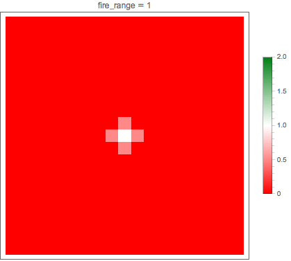

# Rules - Deep Blue

## 游戏背景

废话从略


## 游戏模式 

* 游戏按回合进行, 但侧重**即时战略**
* 对战双方各拥有一基地 `Base`, **己方基地被摧毁**则战败
* 回合数达到上限时, 若双方基地均未被摧毁, 则**积分高者获胜**, 积分相等则平局

### 回合

* 回合以时间划分, 默认`time_per_round = 1000` (单位: ms)
* 回合数从第0回合开始计数, 回合数上限默认`round_max = 200`

### 地图

* 四方格地图
* 地图最大边长`map_size_max = 80`
* 地形:
    * 海洋 `OCEAN` 
    * 陆地 `LAND` 
* 地图分层:
    * 水下 `UNDERWATER` 
    * 水面或地面 `SURFACE` 
    * 空中 `AIR` 
* 海洋的三层均可停留单位
* 陆地的水下层不可停留单位
* 单位不可在不同层次间穿越
* 单位坐标采用三维坐标 `(x, y, z)`, `z` 表示所在地图层次 `level`
* 每个三维坐标点至多被一个单位占据
* 基地大小为 `3*3`, 其余单位为 `1*1`
* 点到点距离按平面直角距离计算`distance = abs(x1 - x2) + abs(y1 - y2)`
* 点到矩形距离取点到矩形内各点距离的**最小值**, 矩形到矩形距离同样取最小值
* **天气**: 默认 `weather = 0`


### 人口

* 人口限制默认`population_max = 60`

### 积分

* 攻下据点 `Fort` 一次性奖励积分`capture_score = 100`
* 占领据点每回合奖励积分`fort_score = 10`
* 每造成一点伤害奖励积分`damage_score = 1`
* 对资源进行一次有效采集(采集到的资源 >= 10)奖励积分`collect_score = 10`


## 单位 `Element` 

###单位属性 `Property`

* 三层视野 `sight_ranges` 
* 三层射程 `fire_ranges` 
* 生命值上限 `health_max` 
* 燃料上限 `fuel_max` 
* 弹药上限 `ammo_max` 
* 单次攻击消耗弹药量 `ammo_once` 
* 金属上限 `metal_max` 
* 金属 `metal` 
* 速度 `speed` 
* 人口 `population` 
* 生产花费金属 `cost` 
* 生产所需回合 `build_round` 
* 火力和鱼雷攻击力 `attacks` 
* 对火力和鱼雷防御力 `defences` 

### 单位状态量

* 索引号 `index`: 每个单位被生产或初始状态下被随机赋予 `index`, 单位被摧毁后 `index` 失效, 各单位 `index` 不重复
* 位置 `pos`: 单位坐标, 对于基地则是矩形区域左上顶点坐标
* 种类 `type`
* 队伍 `team`: `team = 2` 表示中立
* 生命值 `health`
* 燃料 `fuel`
* 弹药 `ammo`
* 金属 `metal`
* 当前目的地 `destination`: 移动目的地, `destination == pos` 表示原地待命

### 视野与迷雾

* 天气影响所有单位所有层次视野
    `modified_sight_range = max(0, sight_range + weather)`
* 天气不影响射程
* 视野内
    * 矿场和油田全部信息可见
    * 其余非己方单位燃料, 弹药, 金属和目的地不可见: `fuel = ammo = metal = 0`
* 视野外
    * 基地燃料, 弹药和金属不可见: `fuel = ammo = metal = 0`
    * 据点生命值, 燃料, 弹药和金属不可见: `health = fuel = ammo = metal = 0`, 归属信息不可见: `team = 2`
    * 矿场油田剩余资源量不可见: `fuel = 0` or `metal = 0`
    * 其余单位完全不可见

### 基地 `Base` 

* 陆地建筑
* 地面层
* 不可攻击水下目标
* 免疫鱼雷伤害
* 弹药无限
* 可储存金属, 用以生产单位
* 自身不可再生, 掉血后不可恢复
* 可对周围单位进行补给
* 可以维修周围单位

### 据点 `Fort` 

* 陆地建筑 
* 地面层
* 不可攻击水下目标
* 免疫鱼雷伤害
* 可储存金属, 但不可生产单位
* 默认初始状态无主, 不属于任何一方
* 其他单位通过攻击, 将据点生命值打至0, 即可占领该据点, 据点归造成致命一击的一方所有, 玩家可对己方占领的据点下达指令
* 被占领的据点生命值立刻回满, 其余资源保持不变
* 无主据点不会自动反击
* 可对周围单位进行补给


### 矿场 `Mine` 

* 陆地建筑
* 金属资源点
* 地面层
* 通过运输船采集其中的资源
* 无归属, 不可占领

### 油田 `Oilfield` 

* 陆地建筑
* 燃料资源点
* 地面层
* 通过运输船采集其中的资源
* 无归属, 不可占领

### 潜艇 `Submarine` 

* 可移动单位 `Unit` 
* 水下层
* 不可造成火力伤害, 只能造成鱼雷伤害
* 免疫火力伤害
* 不可运输金属

### 驱逐舰 `Destroyer` 

* 可移动单位
* 水面层
* 不可运输金属

### 航母 `Carrier` 

* 可移动单位
* 水面层
* 不可造成鱼雷伤害
* 不可运输金属
* 可补给各种单位, 包括飞机
* 航母的攻击由舰载机发出, 故航母攻击为常数, 不受距离和射程影响

### 运输舰 `Cargo` 

* 可移动单位
* 水面层
* 无攻击能力
* 可运输金属
* 可采集资源
* 可补给除飞机外的单位

### 战斗机 `Fighter` 

* 可移动单位
* 飞机 `Plane` 
* 空中层
* 可以攻击潜艇
* 免疫鱼雷伤害
* 不可运输金属

### 侦察机 `Scout` 

* 可移动单位
* 飞机
* 空中层
* 可以攻击潜艇
* 免疫鱼雷伤害
* 不可运输金属


## 指令


### 攻击`AttackPos & AttackUnit`

* 攻击, 维修, 补给互斥, 同一单位一回合内至多执行上述三个指令之一, 后发出的指令会覆盖前一个指令, 若后发出的指令是无效指令, 则仍保留前一个指令
* 两种伤害类型
    * 火力伤害 `FIRE` 
    * 鱼雷伤害 `TORPEDO` 
* 火力与鱼雷伤害叠加计算: `damage = fire_damage + torpedo_damage`
* 伤害超出目标剩余生命值则 `damage = target_unit.health`
* 无友军伤害
* 成功发动一次攻击(**不一定造成伤害**, 可能未命中, 伤害被免疫或目标为友军), 则 `ammo -= ammo_once`
* 当 `ammo < ammo_once` 时无法攻击
* `AttackPos` 可能未命中, `AttackUnit` 必中
* `AttackPos` 有什么用? **任性** (雾霾很重的时候就有用啦= =)
* 运输舰无攻击力
* 潜艇只能造成和接受鱼雷伤害
* 陆地建筑只能造成和受到火力伤害
* 飞机对鱼雷伤害免疫
* 根据攻防双方距离 `distance` 以及攻方射程 `fire_range` 对理论攻击力 `attack` 进行修正

        modifiedAttack = int((1 - float(distance - fire_range / 2) / (fire_range + 1)) * attack)

    修正系数随fire_range的变化：
    

* 上式攻方射程 `fire_range` 为攻方在目标所在地图层的射程
* 修正系数可能 > 1
* 航母修正系数恒为1
* 将据点生命值减至0的一方即可占领据点
* 被摧毁的目标信息将被删除, 之后无法再访问到已死亡单位信息

### 移动 `Move` & 改变目的地 `ChangeDest`

* 移动一格消耗1单位燃料
* 飞机每回合至少消耗1单位燃料, 即
    * 原地待命(盘旋), 消耗1单位燃料
    * 移动一格, 消耗1单位燃料
    * 移动n格, 消耗n单位燃料
* 飞机燃料 `fuel <= 0` 时**立即坠毁**
* 各单位每回合只能移动一次, 移动步数上限为 `speed`
* 目的地不一定要设为本回合能到达的位置, 每回合单位会保持原来路线继续自动向目的地移动
* 飞机无视地形移动
* 其他可移动单位只能在海洋移动
* 运输舰移动后停在到资源点距离为1的位置将**自动采集**资源, 移动路径经过资源点则不采集
* **不考虑移动过程中被其他单位阻挡**
* 在移动结算阶段, 速度 `speed` 较大的单位先结算移动, 速度相等的单位结算顺序随机
* 若单位在某回合即将停留在某位置, 但该位置已存在其他单位, 则该单位停在移动路径的上一格, 若仍被占据则继续向回退... 若移动路径全部被其他单位占据, 则无法移动, 原地停留

### 生产 `Produce`

* 全局指令
* 可同时生产多个单位
* 生产消耗金属 `metal = cost`
* 消耗的金属从基地扣除
* 生产单位需要经过 `round = build_round`
* 基地 `metal < cost` 时, 加入生产队列失败
* 达到人口上限不影响继续生产, 但经过 `build_round` 后, 单位出生时, 若出生后超过人口上限, 则无法造出单位, 卡在生产队列, 直至人口能容纳
* 生产出的新单位不附带燃料和金属, 即 `fuel = metal = 0`, 生产出的飞机附带燃料 `fuel = 1` 确保其不会立即坠毁
* 生产出新单位后基地自动附加补给操作, 对于运输舰, 基地为其补给燃料 `= Cargo.fuel_max / 2`, 其他尽力补给
* 新出生的单位的出生地:
    * 飞机: 基地上空空位随机出现
    * 其他: 到基地距离为1的位置随机出现
* 若无空位, 则单位会卡在生产列表


### 维修 `Fix` 

* 基地特有指令
* 每恢复1点生命所需金属`metal_per_health = 0.2`
* or 1单位金属可恢复生命值`health_per_metal = 5`
* 维修模式为尽力补满目标生命值, 理论消耗金属 
    `metal = Ceiling(metal_per_health * (target_unit.health_max - target_unit.health))`
* 剩余金属不足以补满目标生命值则耗尽所有剩余金属进行维修操作, 恢复血量
    `health_recovery = metal * health_per_metal`
* 维修完毕自动附加补给操作, 且为尽力补给, 不可调补给量(但仍不会补给金属)
* 维修距离:
    * 飞机: 0, 即在基地正上方
    * 其他: 1, 即在基地周围

### 补给 `Supply` 

* 不同单位补给操作有不同的默认补给量, 提供了接口, 选手可根据实战需要灵活调整补给量
```cpp
void Supply(int operand, int target, int fuel, int ammo, int metal);
```
* 基地默认尽力补给燃料和弹药, 默认不对外补给金属
* 基地弹药无限, 其他单位不会向基地补给弹药
* 据点默认尽力补给燃料, 弹药和金属
* 运输舰对基地据点默认尽力补给燃料, 弹药和金属, 对其他单位默认不补给金属
* 航母默认尽力补给燃料和弹药, 航母不可运输金属
* 运输舰不可补给飞机

### 采集 `Collect`

* 被动指令, 移动到合适位置自动生效
* 尽力采集

### 取消 `Cancel`

* 取消当前单位的所有指令

## 事件结算顺序

同种类事件结算顺序随机(**除移动**)
* 加入生产列表 `AddProductionEntry`
* 攻击 `AttackPos` & `AttackUnit`
* 补给 `Supply`
* 维修 `Fix`
* 改变目的地 `ChangeDest`
* 移动 `Move`
* 占领据点每回合加分


# 附表：单位参数

|     属性     |  基地  |  据点  | 矿场 | 油田 |  潜艇 | 驱逐舰 |  航母 | 运输舰 | 战斗机 | 侦察机  |
| ------------ | ------ | ------ | ---- | ---- | ----- | ------ | ----- | ------ | ------ | ------- |
| 视野         | 4,10,8 | 3,8,6  | None | None | 6,5,3 | 5,8,6  | 3,8,8 | 2,6,5  | 1,7,8  | 2,12,16 |
| 射程         | 0,7,5  | 0,5,4  | None | None | 5,5,0 | 4,8,6  | 0,8,6 | None   | 1,3,4  | 2,3,4   |
| 生命值       | 700    | 300    | None | None | 35    | 70     | 120   | 80     | 70     | 50      |
| 造价         | None   | None   | None | None | 7     | 14     | 30    | 16     | 14     | 10      |
| 燃料         | 1000   | 200    | None | 1000 | 120   | 150    | 200   | 300    | 100    | 120     |
| 弹药         | INF    | 300    | None | None | 20    | 40     | 70    | 120    | 21     | 5       |
| 单次攻击消耗 | 6      | 4      | None | None | 2     | 4      | 2     | None   | 3      | 1       |
| 金属         | 200    | 200    | 500  | None | None  | None   | None  | 50     | None   | None    |
| 速度         | None   | None   | None | None | 6     | 7      | 5     | 11     | 9      | 10      |
| 人口         | None   | None   | None | None | 2     | 3      | 4     | 1      | 3      | 1       |
| 攻击         | 40,0   | 30,0   | None | None | 0,40  | 25,25  | 32,0  | None   | 30,20  | 18,7    |
| 防御         | 15,INF | 12,INF | None | None | INF,7 | 13,10  | 16,10 | 15,8   | 10,INF | 7,INF   |
